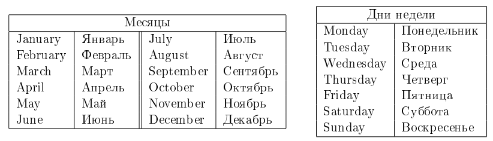
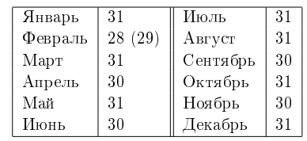

# I. Schedule
<table>
  <tr>
      <td>Time limit</td>
      <td>1 second</td>
  </tr>
  <tr>
      <td>Memory limit</td>
      <td>64Mb</td>
  </tr>
  <tr>
      <td>Input</td>
      <td>standart input or input.txt</td>
  </tr>
  <tr>
      <td>Output</td>
      <td>standart output or output.txt</td>
  </tr>
</table>

How tired Ilya is of studying! First the school, then the university... Finally, the long-awaited day has come when Ilya does 
not have to go to school in the morning. But unfortunately for Ilya, it turned out that after graduation the most difficult 
thing begins — you have to get a job.  

In the world-famous «Goondex» company, in which Ilya got a job, it is customary to work very hard, in particular, a six-day 
working week is established for employees. But, as a bonus, every year «Goondex» offers its employees to choose any day of the 
week as a day off. In turn, the remaining six days of the week will be working days.  

Ilya realized that, taking into account public holidays (which are always weekends), with the right choice of the day off of the 
week, you can vary the number of working days per year. Now he wants to know which day of the week he should choose as a day off 
to rest as many days a year as possible, or, conversely, demonstrate the wonders of hard work by working to the maximum.

## Input format
The first line of the input data contains a single integer <i>N</i> (0 ≤ <i>N</i> ≤ 366) — the number of public holidays.  

The second line contains a single integer <i>year</i> (1800 ≤ <i>year</i> ≤ 2100) — the year in which Ilya needs to be helped.  

Each of the following <i>N</i> lines contains a pair of numbers <i>day month</i> (<i>day</i> is an integer, <i>month</i> is a word, 
between <i>day</i> and <i>month</i> exactly one space), indicating that the day <i>day</i> of the month <i>month</i> is a public 
holiday.  

The last line contains the word <b>day_of_week</b> — the day of the week of the first of January in the year <i>year</i>.  

It is guaranteed that all dates are specified correctly (including the specified day of the week of January first is indeed the day 
of the week of January first of the corresponding year <i>year</i>) and all days of public holidays are different.  

## Output format
Print two days of the week separated by a space — the best and worst variants of the days of the week for the weekend (that is, the 
days of the week for which the maximum and minimum number of days off per year is reached, respectively). If there are several 
possible answers, print any of them.

## Example 1
| Input                                               | Output          |
|:----------------------------------------------------|:----------------|
| 2 2015 1 January 8 January Thursday | Monday Thursday |

## Example 2
| Input                                                             | Output         |
|:------------------------------------------------------------------|:---------------|
| 3 2013 1 January 8 January 15 January Tuesday | Monday Tuesday |

## Example 3
| Input                                                                 | Output            |
|:----------------------------------------------------------------------|:------------------|
| 3 2013 6 February 13 February 20 February Tuesday | Tuesday Wednesday |

## Notes
Let's consider in detail the <b>third example</b>.  

The year 2013 begins and ends on Tuesday, with 53 days of the year on Tuesday and 52 days on all other days of the week. 
All three public holidays fall on Wednesday. If Ilya chooses Tuesday as a day off, then he will have 53 + 3 = 56 days off 
in the year (53 Tuesdays and 3 public holidays). If Ilya chooses Wednesday as his day off, he will have only 52 days off. 
If Ilya chooses any other day of the week as a day off, then he will have 52 + 3 = 55 days off.

Thus, the best option for a weekend is Tuesday, the worst is Wednesday, and <b>the only </b> correct answer in this example 
is Tuesday Wednesday.

Matching the names of months and days of the week in English and Russian:  

Matching the names of the months and the number of days in them:  

There are 29 days in February only in leap years. A year is a leap year if it is a multiple of 400, or a multiple of 4 and 
not a multiple of 100. For example, 1996 and 2000 are leap years, but 1999 and 1900 are not.
