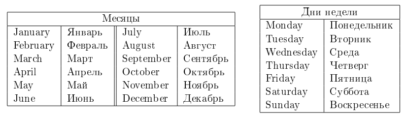
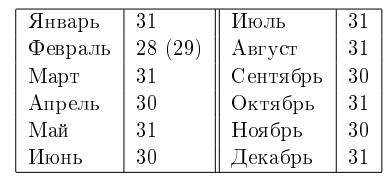

# I. Расписание
<table>
  <tr>
      <td>Ограничение времени</td>
      <td>1 секунда</td>
  </tr>
  <tr>
      <td>Ограничение памяти</td>
      <td>64Mb</td>
  </tr>
  <tr>
      <td>Ввод</td>
      <td>стандартный ввод или input.txt</td>
  </tr>
  <tr>
      <td>Вывод</td>
      <td>стандартный вывод или output.txt</td>
  </tr>
</table>

Как же Илье надоело учиться! Сначала школа, потом университет... Вот, наконец, наступил тот долгожданный день, когда Илье утром 
не надо ехать на учебу. Но, к несчастью для Ильи, оказалось, что после окончания университета начинается самое трудное — надо 
устраиваться на работу.  

Во всемирно известной фирме «Goondex», в которую устроился Илья, принято очень много работать, в частности, для сотрудников 
установлена шестидневная рабочая неделя. Но, в качестве бонуса, «Goondex» каждый год предлагает своим сотрудникам выбрать любой 
день недели в качестве выходного. В свою очередь, оставшиеся шесть дней недели будут рабочими.  

Илья сообразил, что с учётом государственных праздников (которые всегда являются выходными) с помощью правильного выбора 
выходного дня недели можно варьировать количество рабочих дней в году. Теперь он хочет знать, какой день недели ему следует
выбрать в качестве выходного, чтобы отдыхать как можно больше дней в году, или, наоборот, демонстрировать чудеса трудолюбия, 
работая по максимуму.

## Формат ввода
В первой строке входных данных находится одно целое число <i>N</i> (0 ≤ <i>N</i> ≤ 366) — количество государственных праздников.

Во второй строке содержится одно целое число <i>year</i> (1800 ≤ <i>year</i> ≤ 2100) — год, в который необходимо помочь Илье.

В каждой из последующих <i>N</i> строк расположено по паре чисел <i>day month</i> (<i>day</i> — целое число, <i>month</i> — 
слово, между <i>day</i> и <i>month</i> ровно один пробел), обозначающих, что день <i>day</i> месяца <i>month</i> является 
государственным праздником.

В последней строке расположено слово <b>day_of_week</b> — день недели первого января в год <i>year</i>.

Гарантируется, что все даты указаны корректно (в том числе указанный день недели первого января действительно является днём 
недели первого января соответствующего года <i>year</i>) и все дни государственных праздников различны.

## Формат вывода
Выведите через пробел два дня недели — лучший и худший варианты дней недели для выходного (то есть дни недели, для которых 
достигается соответственно максимальное и минимальное количество выходных дней в году). Если возможных вариантов ответа 
несколько, выведите любой из них.

## Пример 1
| Ввод                                                | Вывод           |
|:----------------------------------------------------|:----------------|
| 2 2015 1 January 8 January Thursday | Monday Thursday |

## Пример 2
| Ввод                                                              | Вывод          |
|:------------------------------------------------------------------|:---------------|
| 3 2013 1 January 8 January 15 January Tuesday | Monday Tuesday |

## Пример 3
| Ввод                                                                  | Вывод             |
|:----------------------------------------------------------------------|:------------------|
| 3 2013 6 February 13 February 20 February Tuesday | Tuesday Wednesday |

## Примечания
Рассмотрим подробно <b>третий пример</b>.  

2013 год начинается и заканчивается во вторник (Tuesday), при этом на вторник приходится 53 дня года, а на все остальные дни 
недели –— по 52 дня. Все три государственных праздника выпадают на среду (Wednesday). Если Илья выберет в качестве выходного 
дня вторник, то в году у него будет 53 + 3 = 56 выходных дней (53 вторника и 3 государственных праздника). Если Илья выберет 
в качестве выходного дня среду, то у него будет только 52 выходных дня. Если же Илья выберет в качестве выходного дня любой 
другой день недели, то у него будет 52 + 3 = 55 выходных дней.  

Таким образом, лучший вариант для выходного дня — вторник, худший — среда, и <b>единственным</b> правильным ответом в данном 
примере является Tuesday Wednesday.

Соответствие названий месяцев и дней недели в английском и русском языках:  

Соответствие названий месяцев и количества дней в них:  

В феврале 29 дней только в високосные года. Год является високосным, если он кратен 400, либо кратен 4 и не кратен 100. Например, 
1996 и 2000 являются високосными, а 1999 и 1900 — нет.
